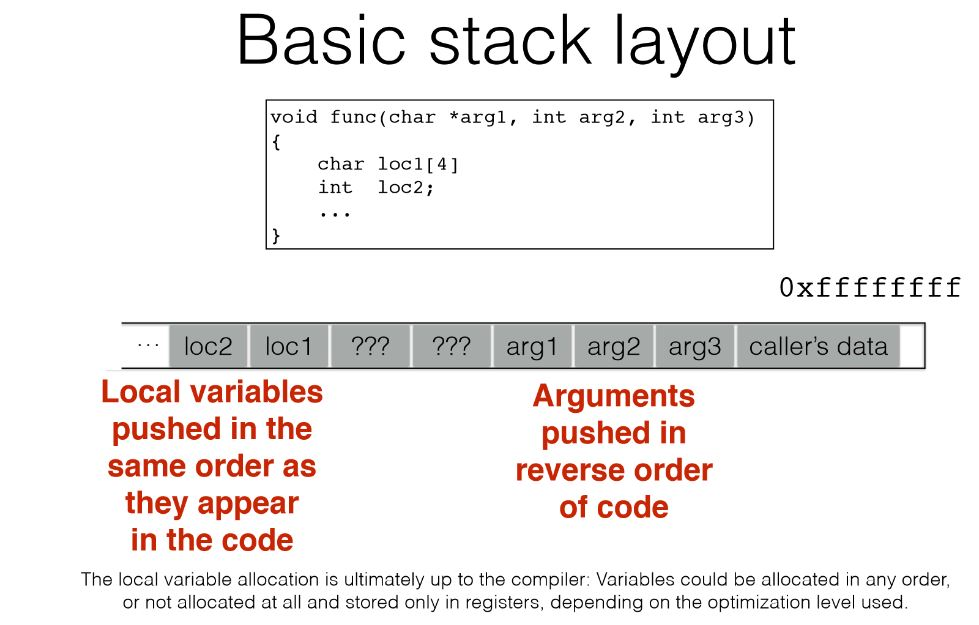
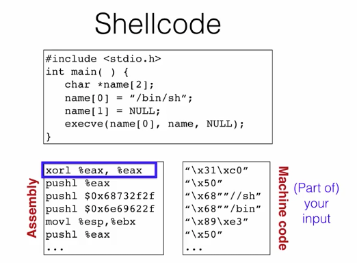

# Intro to Software Security

## Aims
- Should prevent unwanted behaviors like
  - stealing information, or a lack of confidentiality
  - corrupting information or functionality, or a lack of integrity
  - stopping resources from being made available to customers, or a lack of availability
- Should protect against defects, or vulnerabilities
- Should identify and repair bugs or design flaws, before they can be exploited

## Key Terms
- White-box approach: focuses on the code itself, or internals of the program
- Black-box approach: largely ignores the internals of the program and looks at it from the outside as a whole  

# Buffer Overflow
- A buffer is any contiguous chunk of memory assiociated with a variable value or field
- Overflow refers to any time a program tries to read/write more data than the buffer can hold
- Since most compilers assume that there will only be as much data is needed and allocated, it will read whatever data happens to come next in memory
- Ideally, you would write code to check for out of bounds indexes, as this undefined area can be used maliciously

### History of Buffer overflows

- Morris Worm - 1998
- CodeRed - 2001
- SQL Slammer - 2003
- X11 Server buffer overflow - discovered in 2014; stayed there for 23 years

# Memory Layout Overview
- The process itself believes that it owns all of the memory

- From bottom to top:
  - 0x00000000
  - Text segment (the code)
  - Initialized data (`static count int y = 10;`)
  - Unitialized data (`static int x;`)
  - The Heap - area that malloc manages
  - Runtime Area
  - The Stack - holds local variables along with metadata that the program uses to call and return from functions
  - Command line arguments and environment variables, these are set when the process starts

- On push, program will move stack pointer after pushing the value
- On return, program will pop a call off the stack
- Because stack frame arguments and local vars cannot be known at compile time, the program will only know where each variable is *relative* to others

### Summary of Stack and Functions
- Every thread in a process has it's own stack
- This is basically just a chunk of memory used to keep track of the currently running function as well as the functions that were called to get to that point
- Call stack is a specialized version of a stack.
  - Function calls can only be pushed or popped off the top, so it maintains a sequential ordering, FILO
- For each call the stack should store a return address, so the program can continue execution from where it left off

- Very good explanation of the stack and it's security flaws [here](http://arstechnica.com/security/2015/08/how-security-flaws-work-the-buffer-overflow/)

**Note:** 
- `%eip` is the current instruction pointer 
- `%ebp` is the frame pointer
- `%esp` is the end of the stack pointer

###### Calling a function
- Push arguments onto the stack (in reverse order)
- Push on the return address
  - This is the address of the instruction you want to run after control returns to you
- Jump to the function's address    

###### Called Function
- Push the old frame pointer (`%ebp`) onto the stack
- Set the frame pointer (`%ebp`) to where the end of the stack is right now (`%esp`)
- Push the local variables onto the stack

###### Returning function
- Reset the previous stack frame
  - `%esp = %ebp, %ebp = (%ebp)`
- Jump back to the return address
  - `%eip = 4(%esp)`

### Code Injection

###### Loading Code into Memory
- It must be the machine code (assembly language, already compiled and ready to run)
- We have to be careful how we construct it, it can't contain any all zero bytes
  - Because `printf`, `gets`, `scanf`, whatever is used will stop copying over
  - So the challenge is how would you write assembly to never contain a null terminator (all zero byte)
- It can't use the loader, because we're injecting it

###### So what do you do
- Usually the best kind of code to run here would be a general purpose shell
  - This is a command line prompt that gives the attacker general access to the system
- The code to launch this type of shll is called *shellcode*

- The next step is injecting the address to run your function at the `%eip`, this is difficult to find
  - If the address is guessed incorrectly, the program will likely crash
- Since we don't have access to the code, we won't know how far the buffer is from the saved `%ebp`
- One approach is to guess many addresses
- Without address randomization, the stack will always start from the same fixed address
  - Unless the code is heavily recursive, the stack won't grow very deeply
- Another approach is to use a *noop sled*
  - A noop sled is an instruction that just moves the pointer to the next byte
  - Using a bunch of these as padding will make it more likely that the pointer will hit one of your addresses and just move along until it gets to the target code
- This is known as a stack smashing attack
  - This can violate both integrity and availability

### Other Memory Attacks
###### Heap Overflow Attacks
- You can also overflow a buffer allocated by malloc, residing on the heap
- In C++, objects have a vtable, a table of pointers to the methods that an object has
  - Methods in a parent class can be overwritten by a child class
- There is useful object data that may be subject to a buffer overflow attack nearby an objects vtable

###### Integer Overflow Attack
- A variable has a max value, and when it is exceeded it will wrap around
- This can be exploited by forcing a buffer of zero to be allocated
  - Anything put into this buffer afterwards will be overflow

###### Stale Memory
- Memory may be used again after having been freed, and could be accessed maliciously
  - These are often referred to dangling pointers

###### Format String Attack
- A format string is typically the first argument in a  `printf` call
- `%n` is a format string used to print the progress of the `printf` call
  - This could allow the programmer to inject code and cause a `printf` statement to write to a space in memory
